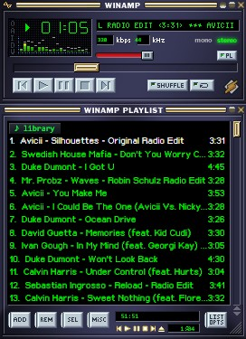
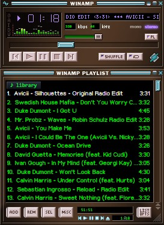
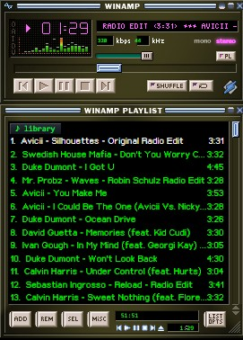
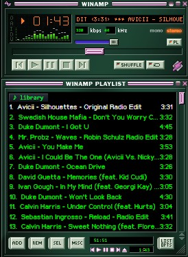
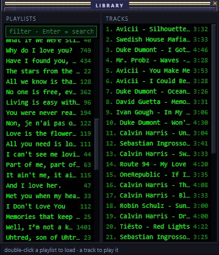
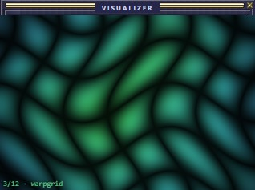
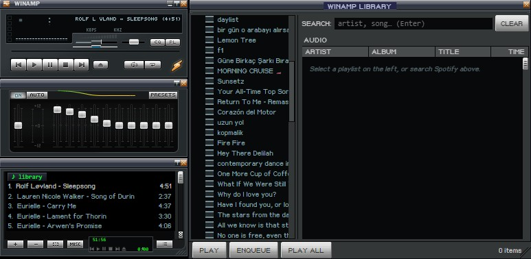
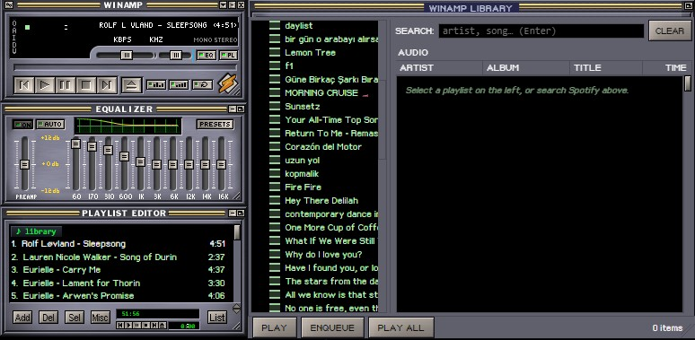
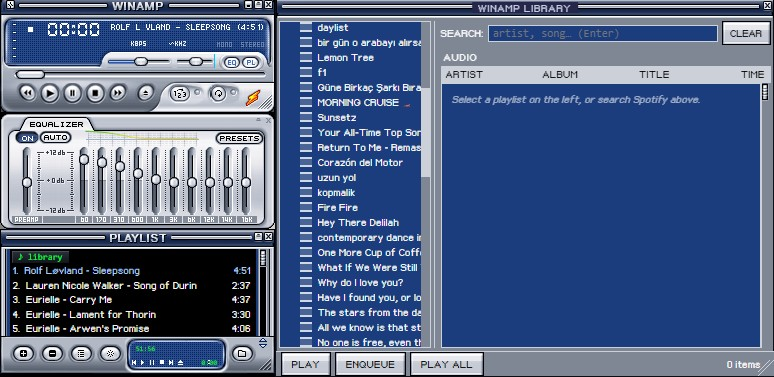

<p align="center">
  
</p>

[](https://discord.gg/8Rq5Xycny4)

A Winamp-style desktop player for **Spotify** — the classic skinned windows, real
skins, a Milkdrop-style visualizer, and full keyboard control, playing your
Spotify Premium account natively (no browser).

Spotiamp+ is a fork of [**tedsteen/Spotiamp**](https://github.com/tedsteen/Spotiamp)
(MIT), extended with a playlist/library browser, catalogue search, docking,
skins, a WebGL visualizer, and much more.

> Requires a **Spotify Premium** account. Playback is handled by
> [librespot](https://github.com/librespot-org/librespot); login uses Spotify's
> own OAuth page.



---

## Features

- 🎵 **Native Spotify playback** — Premium account via librespot (Ogg 320 kbps),
  seek, volume, gapless.
- 📂 **Playlist browser & Library window** — browse your Spotify playlists, open
  a two-pane Library (playlists + tracks), load or queue anything.
- 🔎 **Spotify catalogue search** — search the whole catalogue right in the
  Library. Double-clicking a search result **adds it to the end of the current
  playlist** (it doesn't replace what's playing), so you can build a playlist by
  searching for songs one after another.
- 🧲 **Docking windows** — the Playlist, Equalizer, Library and Visualizer snap
  to the main window and move together, just like classic Winamp.
- 🎚️ **10-band Equalizer** — a pixel-perfect Winamp EQ window with a **real DSP**
  behind it (biquad peaking filters on the decoded audio), preamp, presets and
  the animated response curve. Plus a **balance** slider next to the volume.
- 🎨 **Skins** — right-click the playlist to switch skins live: **Classic**,
  **Cherry**, **Amber**, **Emerald**, plus **six bundled classic Winamp skins**
  right in the menu — the *Classified* series by
  [Victhor](https://victhor.deviantart.com/) and the Sony/Nucleo hardware-style
  skins (all rights remain with their original authors). Or **load any classic
  Winamp 2.x skin (`.wsz`)** with *load .wsz…* — thousands are free at the
  [Winamp Skin Museum](https://skins.webamp.org/). Every window — player,
  equalizer, playlist **and the media library** — reskins live and persists
  across restarts.
- 🌀 **Milkdrop-style visualizer** — a WebGL window with **20 audio-reactive
  patterns** that cycle on click, on a timer, and on every track change.
- 🎤 **Lyrics window** — synced, scrolling lyrics that highlight the current
  line in time with playback (right-click the playlist → *Lyrics…*).
- 🎮 **Discord Rich Presence** — shows the track, artist, **album art** and a
  live progress bar on your Discord profile while it plays, and clears the moment
  playback stops.
- 🔀 **Shuffle & 3-state repeat** — off → repeat-all → repeat-one.
- ⏱️ **Playlist time readouts** — current elapsed + total playlist time.
- 🔌 **Auto-reconnect** — recovers automatically if Spotify drops the session.
- ⌨️ **Keyboard shortcuts** — classic Winamp keys (see below).

## Screenshots

| Classic | Cherry | Amber | Emerald |
| :-----: | :----: | :---: | :-----: |
|  |  |  |  |

| Media Library | Visualizer |
| :-----------: | :--------: |
|  |  |

### Load any classic Winamp skin

Right-click the playlist → *load .wsz…* (or pick one of the bundled skins). Every
window — player, equalizer, playlist and library — reskins live.

| Bento Classified | Winamp3 Classified | Winamp5 Classified |
| :--------------: | :----------------: | :----------------: |
|  |  |  |

| Nucleo NLog | Sony CDX-MP3 | Sony Esprit V2 |
| :---------: | :----------: | :------------: |
|  |  |  |

## Install

1. Download the latest installer from the [**Releases**](../../releases) page.
2. Run it. Windows SmartScreen may warn because the build is unsigned — choose
   **More info → Run anyway**.
3. Launch Spotiamp+ and log in with your Spotify (Premium) account.

## Keyboard shortcuts

**Main window**

| Key | Action | Key | Action |
| --- | --- | --- | --- |
| `Z` `X` `C` `V` `B` | prev / play / pause / stop / next | `Space` | play–pause |
| `↑` `↓` | volume | `←` `→` | seek ∓5s |
| `S` | shuffle | `R` | repeat |
| `L` | open Library | | |

**Playlist window**

| Key | Action |
| --- | --- |
| `Ctrl+A` | select all |
| `Delete` | remove selected |
| `Enter` | play selected |
| `↑` `↓` | move selection (`Alt+↑/↓` reorder) |
| `Z X C V B` | transport (forwarded to the player) |

Double-click the main window's spectrum to open the visualizer; click the
visualizer to cycle patterns.

**In the Library, double-click…**

- a **playlist** → loads it into the playlist window and plays it
- a **playlist track** → plays from that track and keeps the rest queued
- a **search result** → appends it to the end of the current playlist (does not
  replace what's playing) — search again and again to build a list

## Build from source

Requires Rust (stable), Node.js, and the platform toolchain for
[Tauri 2](https://v2.tauri.app/start/prerequisites/) (on Windows: VS C++ Build
Tools + WebView2).

```bash
npm install
npm run tauri dev      # run in development
npm run tauri build    # produce a release installer (src-tauri/target/release/bundle)
```

## Credits

Built on [**tedsteen/Spotiamp**](https://github.com/tedsteen/Spotiamp) (MIT) —
the original Tauri + librespot Winamp-style player. Spotiamp+ adds the browser,
search, library, docking, skins, visualizer and the rest.

Winamp is a trademark of its respective owners; this is an independent
fan project and is not affiliated with or endorsed by Winamp or Spotify.

## License

[MIT](LICENSE) — original © Ted Steen, additions © fdeox.
